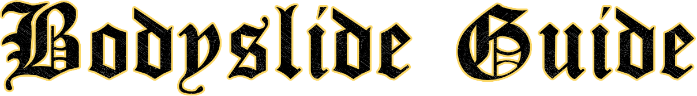

# 

---

# 👚 How to build Outfits in Bodyslide for Licentia NEXT

:::note
**WHY YOU MIGHT NEED THIS?**

You added/updated any outfit/body mods that require Bodyslide to build its outputs.

You want to rerun Bodyslide for any other reason.
:::

These are the general steps to run **Bodyslide** for **Licentia NEXT**:
1. Create an Empty Mod for Outputs
2. Run Bodyslide
3. Select your respective Outfits and Preset
4. Batch Build Outfits to the Output Mod

:::tip
:clock1: This process takes around 20 minutes. Let's dive into the details!
:::

:::caution
If you are going to be building both Male and Female, **you will need to do _Steps 3-4_ twice** for both body types otherwise you only need to do the process for your desired body type.
:::

:::note
Since version `13.4.1` **OBody has returned** to Licentia NEXT, allowing random distribution of body presets to NPCs.

This guide is primarily intended for **re-running** BodySlide as it is provided with the list *OR* **adding new outfit mods** to your NEXT installation.

If you want to remove OBody from your installation, there is a [small tutorial](#%EF%B8%8F-removing-obody-from-your-installation) at the bottom of this guide following the same process with your selected preset instead of `Zeroed Sliders`.
:::
---

## Step :one: &mdash; Create an Empty Mod

At the top of the _Mod Organizer 2_ Window on the icon row next to Profile there is a button with a Wrench and Screwdriver icon, click it.
There will be a list of options available, select `Create Empty Mod`.

You will now be prompted to name your custom mod, this can be named however you want.

:::tip
Adding `[NoDelete]` before the name will make the mod not be removed upon updating the list.

Upon updating the mod will be deactivated and moved to the bottom of the last separator, and you can simply move it into place and enable it.
:::

The new empty mod you made will be created under the `Bodyslide Outputs` Separator, as long as your custom mod is below _Licentia NEXT Bodyslide Output_ your changes will override default Bodyslide outputs.

---

## Step :two: &mdash; Run Bodyslide

Once you have created your **Output mod** head over to the Top Right of `Mod Organizer 2` to the launch section. Open the dropdown and select `BodySlide x64`, then run the program.

Upon opening the program for the first time you will be prompted to select the respective game and Game Data Path.

:::warning
By default SkyrimSE will have it's data checking the default Steam Installation Directory.

This will cause BodySlide to not access the files properly and you will see errors with textures, missing files, etc.
:::

In your Licentia NEXT Installation folder there will be a folder named `Stock Game`. Inside the folder you can `Right Click` **/Data**, and choose `Copy as Path`.
Paste your Installation Path in the Game Data path for Skyrim SE, then hit `OK` to continue to the main interface.

---

## Step :three: &mdash; Select your respective Outfits and Preset

On the top right of the interface there will be two search bars for `Filter Groups` and `Filter Outfits`, select the search icon for `Filter Groups` and select `Choose Groups`:

:::note
In the Outfit/Body dropdown list you will have two main sets of body types, `3BBB/3BA/CBBE` for Female and `HIMBO` for Male.

You will need to select the respective groups for **which body you want to build**, since you cannot build **Male** and **Female simultaneously** due to different presets.
:::

A list will open with various groups to choose outfits for. For **Female** select both `3BBB` and `3BA`, and the related groups such `DX Crimson Blood 3BA`. For **Male** select `HIMBO` and it's applicable groups.

**Here are example group selections for Female and Male outfits:**

 

:::warning
Since version `13.4.1` of _Licentia_ **Dismemberment Framework** has been added, and you will need to manually build outfits `[DF] [CBBE 3BBB/Himbo] Naked Female/Male Dismembered Addons` to `Zeroed Sliders`/`HIMBO Zero for OBody`. These two outfits will be found at the bottom of the `Unassigned` Group.
:::

:::note
You do not need to select every group for building purposes, if you have the base groups selected for example `3BA` or `HIMBO`, _Bodyslide_ will automatically use all the groups containing the names of your selected groups.

However, the group `Unassigned` is excluded from this search as previously detailed with building `Dismemberment Framework` and there is a small range of outfits for `CBBE/3BBB` and `Himbo` that must be manually selected in `Unassigned`. 

You can easily do this process by using the `Filter Outfits` search bar at the very top right next to `Groups`, and search for `CBBE`, then `3BBB` and build those two sets with `Zeroed Sliders`, then search for `Himbo` and build those with `Himbo Zero for OBody`.

Unassigned Group Example

    

Note for building Himbo Groups

    Building `Himbo` will open the conflict resolution window for `IA Asdafa Tweaks`, if you batch build with only `Himbo` selected ignoring conflicts then once that is finished build with only the `Asdafa Overrides` group selected you can build the overrides without needing to resolve conflicts.

:::

Once you have your `Outfits` selected for the body you wish to build, you will need to select a `Preset` from the dropdown at the top of the interface to build your outfits with. 

Due to the list containing ``OBody` you will need to use the following presets respsectively for Female or Male:
- `- Zeroed Sliders -` for Female characters;
- `Himbo Zero for OBody` for Male characters.

You can use any preset in the list or one you have downloaded, make sure you build all respective outfits to the same preset.

For example here are the default Female Presets available in _Licentia NEXT_, with the default preset selected:

---

## Step :four: &mdash; Batch Build Outfits to the Output Mod

Once you have chosen your desired outfits to build for your selected body and preset, it is time to `Batch Build` the outfits to your output.

On the bottom left of the Interface there is the button to `Batch Build`, `Build Morphs`, and select alternatives.
Tick the checkbox for the previewed outfit path, and tick `Build Morphs`.

- After you have ticked the checkbox next to the preview, hold `Left CTRL` and select **Batch Build**.
- A list of outfits will pop up, scroll through and verify everything is correct then press **Build**.
- File Explorer will now open in the Stock Game/Data directory. In the address bar click the root folder of your installation and open /Mods.
- Find the folder for your Empty Mod that was created earlier, for example `[NoDelete] Bodyslide Output`.

Depending on your selections an additional menu may open for choosing Output Sets. If there is conflicting outputs selected, here you can select which alternative you want to select for example Physics versions of Outfits over Non-Physics.

Make your selections then continue, and Bodyslide will convert all your selections and place them in your output.
You can now close Bodyslide.

Back in MO2 once it unlocks right click your Custom Output Mod, after clicking the mod the error for `No Valid Game Data` should now be resolved and disappear.

Tick your Output Mod to enable it, and you will have successfully built Bodyslide Overrides.

:::tip
If you have any further questions or problems, stop by the **Licentia Next** Category in [Vermi's Hub Discord Server](https://discord.gg/vermishub) and we can help you work them out!
:::

## ♻️ Removing OBody from your Installation

If you want to **remove OBody** from your installation for whatever reason you will need to follow the subsequent steps for "building out" OBody.
1. Disable OBody in MO2. Open the `BODIES` Separator or search for `OBody` at the bottom and untick `OBody Next Generation` and `- ORefit JSON Master List`. Additionally under the `Body Meshes (and physics)` separator there is two patch files `3BA with OBody Collision Physics Fix` and it's OSmp patch, disable both of these.
2. Open Bodyslide, and repeat Steps 3-4. When it comes to selecting your preset, pick one from the list or use your own and build your outfits with your selected outfit.

You will need to build **all** outfits used by the list if you remove OBody, as otherwise all outfits will remain zeroed on all sliders.
